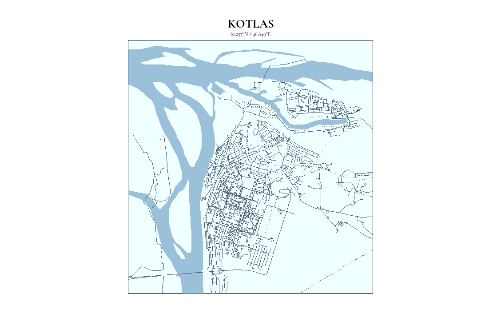

# MAPS

This is a repository of the various maps I've created.

## Navigation
- 
-
-

## Examples

### SEVEROMORSK | Северомо́рск

### KOTLAS | Ко́тлас

### SE Salt Lake Valley

### RESOURCES
- [STREET MAPS](https://taraskaduk.com/posts/2021-01-18-print-street-maps/)
- [MAP CUTOUTS](https://www.katiejolly.io/blog/2019-01-21/map-cutouts)
- [STREET TUTORIAL](http://joshuamccrain.com/tutorials/maps/streets_tutorial.html)
- [RAYSHADER](https://www.rayshader.com/)
- [GEOVIZ](https://cran.r-project.org/web/packages/geoviz/readme/README.html)
- [TREK](https://trek.nasa.gov/tiles/apidoc/index.html)
- [EARTHDATA](https://search.earthdata.nasa.gov/search)
